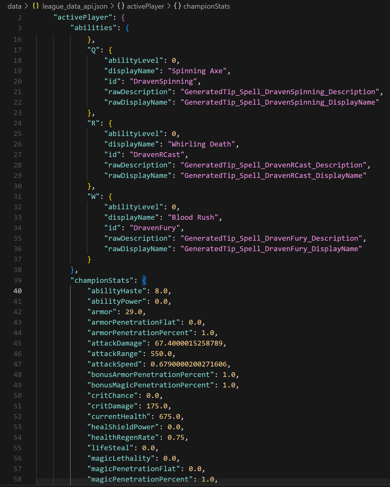
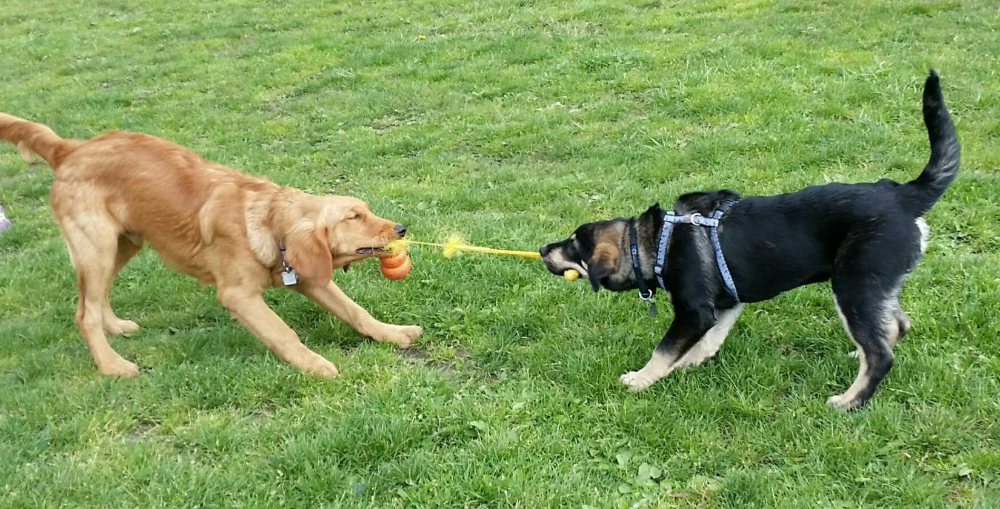
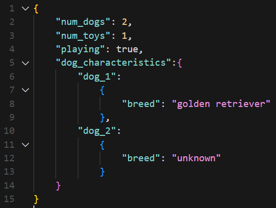
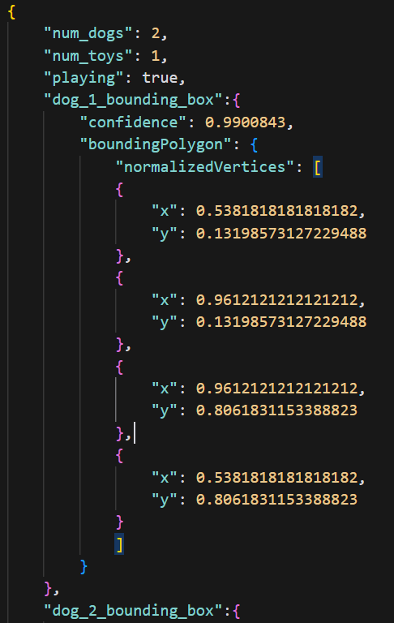
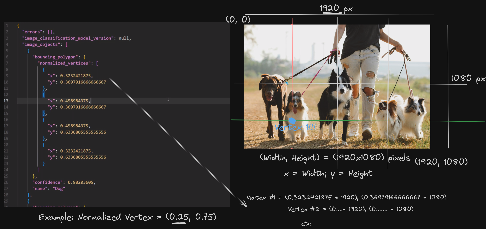
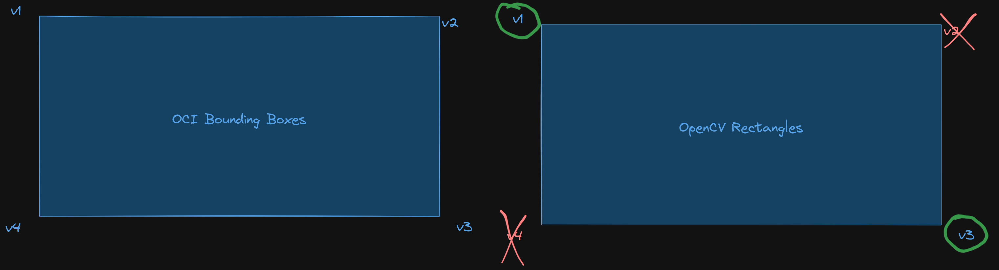

# AI Data in Application Development / Data in the AI Revolution

## Introduction

This repository aims to be a guide on all types of data usually found in the realm of Data Science and Artificial Intelligence.

We are living in the Big Data era, where the volume, velocity, and variety of data generated every day are unprecedented.

From social media interactions, sensor data from IoT devices, transaction records, to large-scale scientific experiments, the amount of data we encounter is huge. This explosion of data in the last decade presents both challenges and opportunities (how do we process all this data efficiently?).

On one hand, managing and processing such vast amounts of data require advanced tools and technologies. On the other hand, this data holds the key to solve many complex problems with the help of computers.

## 0. Prerequisites & Docs

### Prerequisites

In order to follow the contents of this workshop, you will need the following:

1. An Oracle Cloud Infrastructure (OCI) Account. Although it's not explicitly required as you don't have to follow any of the steps by yourself, it's still recommended as you will be able to explore the services and offerings from OCI while we go through the content.

### Docs

- [Computer Vision: COVID-19 Mask Detection - Data Labelingj](https://oracle-devrel.github.io/devrel-labs/workshops/mask_detection_labeling/index.html)
- [Computer Vision: COVID-19 Mask Detection - Model Training](https://oracle-devrel.github.io/devrel-labs/workshops/mask_detection_training/index.html?lab=intro)

## 1. Data for each type of problem

There are lots of problems that fall into the realm of Artificial Intelligence. However, not all data fits the desired format to solve a specific type of problem. Depending on what type of data we have available, we'll be able to use it in one way or the other.

For example, all AI models that are used to generate text require text data. On the other hand, models that are used to process images or video, to detect objects on these images, or segment them, require 2-dimensional data. We'll talk about more of each type of data in the next sections.

### 1-dimensional data (Text)

This is the most common type of data we have available. It's usually found in the form of text, and can be used to train a model to do different things:

- Generate new text, or paraphrase
- Summarize the contents of big documents
- Translate text from one language to another
- Fill in missing words in a text

Large Language Models (LLMs) and text-generation Generative AI (GenAI) fall into this category. Nowadays, we have some models, like GPT-4 or Cohere Command R, that have been trained on terabytes of data (usually unfiltered, compressed text).

Here's a quote from an excerpt on the GPT-3 paper:

"The raw (before filtering) training set was **45TB** of compressed plaintext. After filtering, it was ~570GB. It used text scraped from the internet, wikipedia and books. The final model is ~175B parameters."

The prominent architecture for the Neural Networks in this type of data is called **Transformer** Architecture. We will learn more about how the transformer architecture "mimics" human language, and how it helps computers understand our human way of thinking. Here's a figure representing the transformer architecture:

### 1-dimensional data (Encoded General ML)

This is the type of use case where we have a complex problem, and we need to and we encode the problem.

For example, here we have a project we developed, called League of Legends optimizer, a framework to create your own Machine Learning models for League of Legends, an extremely popular videogame.

Without going into much of the gaming jargon, in this image, we have two teams fighting in the bottom part of the map for gold and kills. League of Legends is such a complex game, that we can't just use the raw data (video) to create a Machine Learning model: remember that ML models are typically hyper-specialized in predicting something. Therefore, we need to **encode** the data we have (images / video, what we see on our screens) in a way that a ML model could understand.

So, from the hundreds of variables we have, we need to do some kind of processing of this data, to turn it into a Machine Learning-friendly format. Using their official API, what you see on the screen gets translated to something like this:

As you can see, one simple image gets translated into a 300-line JSON object (see [the complete JSON struct here](./data/league_data_api.json)), including all things, like items purchased and their order, the current active abilities for each champion, each event that has happened since the beginning of the game... This can translate to hundreds of megabytes of data every match.

With some Exploratory Data Analysis (EDA) we're able to select which variables are useful, and start creating a ML model with this "encoding" we mention.

### 2-dimensional data (Images & Video)

Here, we can find all problems related with the following use cases:

- Object detection
- Image segmentation
- Video processing

Sometimes, detecting an object can be quite easy, as many objects we encounter in real life are very repetitive and can be found anywhere. For this purpose, there are lots of pre-trained models available, which can be used to detect objects in an image.

The issue arises when we're trying to detect something **new**, or something noone had trained a model in the past. For this, we need to train our custom models.

This is an example: during the COVID-19 pandemic, and since masks weren't broadly used prior to that - except for some countries like China - we needed to create our custom detection system to detect 3 mask states:

- Properly-worn masks (with the nose and both ears covered)
- People with no mask on whatsoever (there are lots of examples on the Internet for this, as 99% of people on the Internet don't have masks on their pictures)
- Incorrectly-worn masks (either the nose not covered, people with the mask hanging from one ear...): this is what we specifically wanted to detect with our model: warn of those users wearing their mask incorrectly and ask them to place the mask correctly.

Typically, companies and products offer this processing through APIs and Data Engineering tools, to help extract data from the sources. For example, having this picture:

And returning the following information in a simplified manner:

A perfect model would, in theory, return **all** the information from an image. We can never have all of the information: since we can't know what the data will be used for, we would like to extract as much data as possible, to accomodate to every kind of problem. Here's an example of the above JSON object, complimented with detections retrieved from **OCI Vision**:

In the guide, we'll dive deeper into how these results can be interpreted and integrated as a developer into your workstream.

## 2. Predictive ML: In Depth

## 3. Large Language Models: In Depth

## 4. Computer Vision: In Depth

## 5. Experimental Tech: Quantization

Here's an example of how to interpret the result from an API call to OCI Vision:

Even though most data representations are similar in general, there are always difference. This is the reason why checking the official documentation is important (and will save you time overall!). For example, in the following image:

You can see that the bounding box representation of the detected object in the image varies, depending on which framework / service we're using: OCI Vision uses a different number of keypoints (4) (as well as a different order of these keypoints) when compared to OpenCV (only gives you the top left and bottom right keypoint).

### Contributors

Author: [Nacho Martinez](https://github.com/jasperan)

Last release: July 2024

This project is open source. Please submit your contributions by forking this repository and submitting a pull request!  Oracle appreciates any contributions that are made by the open source community.

### License

Copyright (c) 2024 Oracle and/or its affiliates.

Licensed under the Universal Permissive License (UPL), Version 1.0.

See [LICENSE](LICENSE) for more details.

ORACLE AND ITS AFFILIATES DO NOT PROVIDE ANY WARRANTY WHATSOEVER, EXPRESS OR IMPLIED, FOR ANY SOFTWARE, MATERIAL OR CONTENT OF ANY KIND CONTAINED OR PRODUCED WITHIN THIS REPOSITORY, AND IN PARTICULAR SPECIFICALLY DISCLAIM ANY AND ALL IMPLIED WARRANTIES OF TITLE, NON-INFRINGEMENT, MERCHANTABILITY, AND FITNESS FOR A PARTICULAR PURPOSE.  FURTHERMORE, ORACLE AND ITS AFFILIATES DO NOT REPRESENT THAT ANY CUSTOMARY SECURITY REVIEW HAS BEEN PERFORMED WITH RESPECT TO ANY SOFTWARE, MATERIAL OR CONTENT CONTAINED OR PRODUCED WITHIN THIS REPOSITORY. IN ADDITION, AND WITHOUT LIMITING THE FOREGOING, THIRD PARTIES MAY HAVE POSTED SOFTWARE, MATERIAL OR CONTENT TO THIS REPOSITORY WITHOUT ANY REVIEW. USE AT YOUR OWN RISK.
