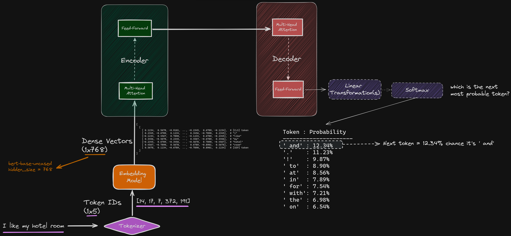
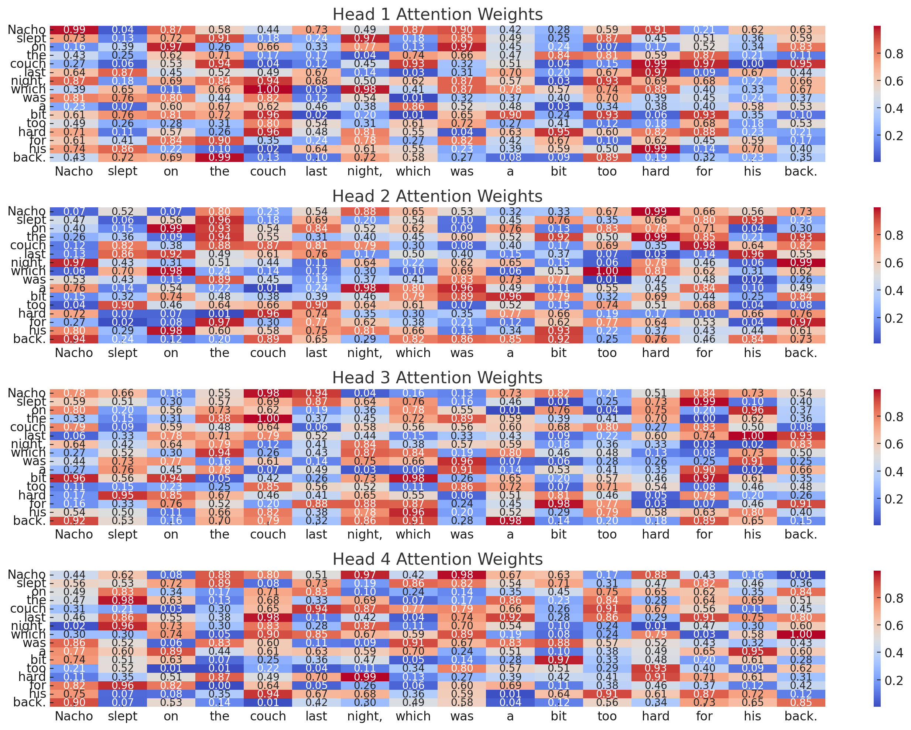

# AI Data in Application Development / Data in the AI Revolution

## Introduction

This repository aims to be a guide on all types of data usually found in the realm of Data Science and Artificial Intelligence.

We are living in the Big Data era, where the volume, velocity, and variety of data generated every day are unprecedented.

From social media interactions, sensor data from IoT devices, transaction records, to large-scale scientific experiments, the amount of data we encounter is huge. This explosion of data in the last decade presents both challenges and opportunities (how do we process all this data efficiently?).

On one hand, managing and processing such vast amounts of data require advanced tools and technologies. On the other hand, this data holds the key to solve many complex problems with the help of computers.

## 0. Prerequisites & Docs

### Prerequisites

In order to follow the contents of this workshop, you will need the following:

1. An Oracle Cloud Infrastructure (OCI) Account. Although it's not explicitly required as you don't have to follow any of the steps by yourself, it's still recommended as you will be able to explore the services and offerings from OCI while we go through the content.

### Docs

- [Computer Vision: COVID-19 Mask Detection - Data Labelingj](https://oracle-devrel.github.io/devrel-labs/workshops/mask_detection_labeling/index.html)
- [Computer Vision: COVID-19 Mask Detection - Model Training](https://oracle-devrel.github.io/devrel-labs/workshops/mask_detection_training/index.html?lab=intro)

## 1. Data for each type of problem

There are lots of problems that fall into the realm of Artificial Intelligence. However, not all data fits the desired format to solve a specific type of problem. Depending on what type of data we have available, we'll be able to use it in one way or the other.

For example, all AI models that are used to generate text require text data. On the other hand, models that are used to process images or video, to detect objects on these images, or segment them, require 2-dimensional data. We'll talk about more of each type of data in the next sections.

### 1-dimensional data (Text)

This is the most common type of data we have available. It's usually found in the form of text, and can be used to train a model to do different things:

- Generate new text, or paraphrase
- Summarize the contents of big documents
- Translate text from one language to another
- Fill in missing words in a text

Large Language Models (LLMs) and text-generation Generative AI (GenAI) fall into this category. Nowadays, we have some models, like GPT-4 or Cohere Command R, that have been trained on terabytes of data (usually unfiltered, compressed text).

Here's a quote from an excerpt on the GPT-3 paper:

"The raw (before filtering) training set was **45TB** of compressed plaintext. After filtering, it was ~570GB. It used text scraped from the internet, wikipedia and books. The final model is ~175B parameters."

The prominent architecture for the Neural Networks in this type of data is called **Transformer** Architecture. We will learn more about how the transformer architecture "mimics" human language, and how it helps computers understand our human way of thinking. Here's a figure representing the transformer architecture:

### 1-dimensional data (Predictive ML)

This is the type of use case where we have:

- Loads of data in one specific domain
- The need to transform this data into a manageable (in size), deterministic **predictor** of one or multiple variables in the data.
- We want the ML model to make a predictions using as many *important* variables as possible, to achieve maximum precision on predictions
- The problem we're solving typically needs to be so big/untimely that you'll be saving time by creating a ML model to make your life easier now, or in the future.

For example, here we have a project we developed, called [League of Legends optimizer](https://github.com/oracle-devrel/leagueoflegends-optimizer), a framework to create your own Machine Learning models for League of Legends, an extremely popular videogame.


Without going into much of the gaming jargon, in this image, we have two teams fighting in the bottom part of the map for gold and kills. League of Legends is such a complex game, that we can't just use the raw data (video) to create a Machine Learning model -in theory, we could, but detecting the objects that appear on the screen would offer no value other than the mere excitement from creating such a model-.

Remember that ML models are typically hyper-specialized in predicting something. Therefore, we need to **encode** the data we have (images / video, what we see on our screens) in a way that a ML model could understand (numbers).

So, from the hundreds of variables we have, we need to do some kind of processing of this data, to turn it into a Machine Learning-friendly format. Using their official API, what you see on the screen gets translated to something like this:


As you can see, one simple image gets translated into a 300-line JSON object (see [the complete JSON struct here](./data/league_data_api.json)), including all things, like items purchased and their order, the current active abilities for each champion, each event that has happened since the beginning of the game... This can translate to hundreds of megabytes of data every match.

With some Exploratory Data Analysis (EDA) we're able to select which variables are useful, and start creating a ML model with this "encoding" we mention.

### 2-dimensional data (Images & Video)

Here, we can find all problems related with the following use cases:

- Object detection
- Image segmentation
- Video processing

Sometimes, detecting an object can be quite easy, as many objects we encounter in real life are very repetitive and can be found anywhere. For this purpose, there are lots of pre-trained models available, which can be used to detect objects in an image.

The issue arises when we're trying to detect something **new**, or something noone had trained a model in the past. For this, we need to train our custom models.

This is an example: during the COVID-19 pandemic, and since masks weren't broadly used prior to that - except for some countries like China - we needed to create our custom detection system to detect 3 mask states:

- Properly-worn masks (with the nose and both ears covered)
- People with no mask on whatsoever (there are lots of examples on the Internet for this, as 99% of people on the Internet don't have masks on their pictures)
- Incorrectly-worn masks (either the nose not covered, people with the mask hanging from one ear...): this is what we specifically wanted to detect with our model: warn of those users wearing their mask incorrectly and ask them to place the mask correctly.

[](https://www.youtube.com/watch?v=LPRrbPiZ2X8)

Typically, companies and products offer this processing through APIs and Data Engineering tools, to help extract data from the sources. For example, having this picture:


And returning the following information in a simplified manner:


A perfect model would, in theory, return **all** the information from an image. We can never have all of the information: since we can't know what the data will be used for, we would like to extract as much data as possible, to accomodate to every kind of problem. Here's an example of the above JSON object, complimented with detections retrieved from **OCI Vision**:


In the guide, we'll dive deeper into how these results can be interpreted and integrated as a developer into your workstream.

## 2. Predictive ML: In Depth

## 3. Large Language Models: In Depth

LLMs use the Transformer Architecture to learn and make predictions using Neural Networks.

There are three types of LLM architectures within the transformer architecture, and each type specializes on solving a type of problem:

- Encoder-only: it's good at understanding input text. It's widely used for tasks like **text completion** (completing missing words in a sentence) and **text classification**. An example is BERT (Bidirectional Encoder Representations from Transformers), a quite popular encoder-only model used for sentiment analysis and many other language related tasks that require a deep understanding of the context of words.
- Decoder-only: it's good at generating text. It's used for **text generation / completion**, what you typically have nowadays with OpenAI, OCI GenAI, etc. Their GPT models are decoder-only.
- Encoder-decoder: it's good at understanding both the input and generating the output. It's used in tasks like **text translation** and **summarization**. An example model is T5, used for text translation.

As you can see on the following figure, the typical architecture of transformers is the following:



> We will refer back to this figure during this session as it contains the most mentioned components of LLMs

There are two things being highlighted: **self-attention** and **feed-forward**. But, what does this mean, and how are these concepts applied in Neural Networks?

When using these models, we need to remember that a Neural Network only understands numbers, not our alphabets and languages. Therefore, there's a special part on these systems, which takes charge in doing the required human-to-machine translation: from characters or groups of characters (we call them **tokens**) to their numerical equivalent representations. This functionality is provided by the **tokenizer** and the **embeddings model**.

We will check out all these concepts in the following subsections.

### Tokenizer & Embeddings Model

A tokenizer is the part of the system that breaks down the original, human-readable text into smaller units, called tokens. Tokens represent words, characters or groups of characters; this is determined by the tokenization strategy used by the creator of the tokenizer.

The tokenizer converts the text into a sequence of token IDs, and these IDs are then stored in a reference table so that this process can then be reverted back into human-readable language at the last step of the transformer architecture, so we can read the text back.

In a simplified example, from the sentence "I am happy", we would get:

```bash
[13, 93, 732]
```

Then, these token IDs are used by the **embedding model**, which converts this sequence of IDs into *dense vector* representations. These dense vector representations try to encapsulate the meaning, syntax and context of tokens.

These dense vectors have hundreds of dimensions, many more than the sequence of token IDs. For example, in the case of BERT, each token is represented by a 768-dimension dense vector.

On a final note, since the tokenizer and the embedding model work together, they need to be perfectly **in sync**, as the tokenizer needs to produce token IDs that will be identified and recognized by the embedding model; otherwise, the hidden meaning in words we use as humans wuold be lost or misinterpreted.

Tokenizer and embedding model are sometimes used interchangeably as they are often packaged together, but they are different components that work in unison.

### Self-Attention or Multi-Head Attention

Self-attention is the mechanism used to determine the importance of different parts of an input text when processing this text. This is the foundation of LLMs in the sense that it captures what we call as the **context** of a large input text.

For each token in the input text, self-attention considers and keeps 3 variables:

- Query: what the token is looking for, Q: it holds the current word or token for which we want to compute the attention weights
- Key: what the token can offer, K: it's a vector that represents each word or token in a text sequence. It's useful to match against Q (dot product), and determine how much attention the query should pay to each word in the sentence.
- Value: the value of the token, V

Then, for each token, the attention score of this token with every other token is calculated. In an over-simplified manner, for a token `x`, this calculation is the dot product of `Q(x)·K(y)`, where `y` is another token in the input sequence (and then some transformations to those results).

On the other hand, multi head attention is the **improved** version of self-attention, where we have multiple sets of (Q,K,V) matrices (typically 8 or 16 on current SoTA models). These sets of matrices are what's called the **attention heads**, and each head can focus on different concepts:

- One head can focus on syntactic relationships between words
- Another can focus on the semantics
- Two other can focus on the short and long-range relationships between words...

The number of these attention heads and their behavior is configured by the creators of the models, and directly affects the output of a model, as it determines what this model focuses on when reading the input text.

Let's say we have the following sentence:

```bash
"Nacho slept on the couch last night, which was a bit too hard for his back."
```

Each head would look at different parts of the text, and create their respective (Q,K,V) matrices. For example:

Head #1 focusing on **syntactic** relationships:

- subject-verb relationships: studies the relationship between "Nacho" and "slept"
- verb-object relationships: "slept" and "couch"
- preposition-object relations: "on" and "couch"

Then, another head to study **temporality** (when the action occurred):

- `slept` and `last night` describe when the action of sleeping occurred.
- `was` and `last night` describe the temporal context for the roughness of the couch, last night.

Another one for **causal relationships**:

- `hard` and `back` describe the impact the couch had on my back
- `slept` and `couch` and `hard` and `back` describe a chain of events, called chain of causation

And this can go on and on until 8 or 16 attention heads (typically). This allows the context of what we are reading to *assimilate* what the human brain does with neurons in the background, and truly gives us a glimpse of how incredibly intelligent we are, as humans that use language, without even noticing it.

These subtleties in language are what is in the end calculated by the heads, and they are then *concatenated* and *linearly transformed* to produce a numerical, LLM-friendly representation for **each token** in the input text.

Thanks to this, and going back to our previous example, the model was able to consider the following aspects (and more) from the text:

- The syntactic role of "hard" as an adjective describing the couch
- The temporal context of when the couch was hard
- The object (couch) that "hard" is describing
- The consequence of the hardness (effect on the back)
- ...and many more.

Here's a visualization of each head's attention weights:



This gives you an idea, in this example, of how each head looks at the text in a different manner, depending on how they've been programmed.

I have created [a Python script](./scripts/check_attention_heads.py) so you can visually see the differences in attention weights from each head based on your own input. To run it:

```bash
pip install -r scripts/requirements.txt
python scripts/check_attention_heads.py
```

### Feed-Forward NNs

Without going much into detail (yet) into Neural Networks, there are two types of Neural Networks: Feed-Forward NNs and Recurrent NNs (RNNs).

INSERT TODODOODODODODODODOODODODODODODODOO

For now, just know that a FFN (Feed-Forward Neural Network) is a type of NN where we see only forward steps from the inputs towards the outputs.

Since data is transmitted always in the same direction, a FFN doesn't learn from iterations the same way a RNN does. However, it doesn't need to: self-attention does the learning part, and the FFN is used for two reasons:

- With FFns, you can process all operations in parallel, which results in less training and inference times
- You don't run into some common issues that happen in RNNs, like the **vanishing/exploding gradient problems**, which happens when propagating data backwards (backpropagating) through the RNN during the training phase (either gradients become extremely small or huge, which leads to having minimal weight updates, slowing or preventing the learning mechanism from working).

For example, imagine a text with 100 words.

```bash
"I am a scientist. I began my experiment by creating my dataset and then kept going... <some words in the middle> ... And in the end, it worked, and I was subsequently hit in the face with a splash of joy and enthusiasm."
```

Let's have a look at what the Neural Network would do with our text:

- The network processes this text token by token
- At each step, it tries to predict the next word based on all previous words (remember generations are done token by token, recursively)
- When training, if we focus on predicting the last word, "enthusiasm", the error gradient needs to be backpropagated all the way back to the beginning of the sentence (100 times).

Consider an RNN processing a this sequence. The gradient at step 100 needs to be propagated back through all 100 steps. If at each step, the gradient is multiplied by 0.9:

```bash
0.9^100 ≈ 2.66 × 10^-5 (an extremely small number) = 0.0000266
```

This means that the contribution percentage of the first word "I" to predicting "enthusiasm" is scaled down by a factor of about 0.0000266, meaning, about 37.500 times. This tiny gradient makes it very difficult for the network to learn long-term dependencies, such as understanding that the entire paragraph is about a scientific experiment, which might be relevant for predicting words near the end.

This problem gets worse the longer our paragraph gets, which isn't great. That's why the vanishing gradients problem is something to avoid when working with Neural Networks.

In the case of FFNs, the self-attention mechanism allows direct connections between any two positions in the sequence, regardless of their distance. This easily avoids the vanishing gradients problem in most cases, except for some very isolated issues in very deep networks (with lots of hidden layers).

## 4. Computer Vision: In Depth

Here's an example of how to interpret the result from an API call to OCI Vision:


Even though most data representations are similar in general, there are always difference. This is the reason why checking the official documentation is important (and will save you time overall!). For example, in the following image:


You can see that the bounding box representation of the detected object in the image varies, depending on which framework / service we're using: OCI Vision uses a different number of keypoints (4) (as well as a different order of these keypoints) when compared to OpenCV (only gives you the top left and bottom right keypoint).

## 5. Experimental Tech: Quantization

### Contributors

Author: [Nacho Martinez](https://github.com/jasperan)

Last release: July 2024

This project is open source. Please submit your contributions by forking this repository and submitting a pull request!  Oracle appreciates any contributions that are made by the open source community.

### License

Copyright (c) 2024 Oracle and/or its affiliates.

Licensed under the Universal Permissive License (UPL), Version 1.0.

See [LICENSE](LICENSE) for more details.

ORACLE AND ITS AFFILIATES DO NOT PROVIDE ANY WARRANTY WHATSOEVER, EXPRESS OR IMPLIED, FOR ANY SOFTWARE, MATERIAL OR CONTENT OF ANY KIND CONTAINED OR PRODUCED WITHIN THIS REPOSITORY, AND IN PARTICULAR SPECIFICALLY DISCLAIM ANY AND ALL IMPLIED WARRANTIES OF TITLE, NON-INFRINGEMENT, MERCHANTABILITY, AND FITNESS FOR A PARTICULAR PURPOSE.  FURTHERMORE, ORACLE AND ITS AFFILIATES DO NOT REPRESENT THAT ANY CUSTOMARY SECURITY REVIEW HAS BEEN PERFORMED WITH RESPECT TO ANY SOFTWARE, MATERIAL OR CONTENT CONTAINED OR PRODUCED WITHIN THIS REPOSITORY. IN ADDITION, AND WITHOUT LIMITING THE FOREGOING, THIRD PARTIES MAY HAVE POSTED SOFTWARE, MATERIAL OR CONTENT TO THIS REPOSITORY WITHOUT ANY REVIEW. USE AT YOUR OWN RISK.
